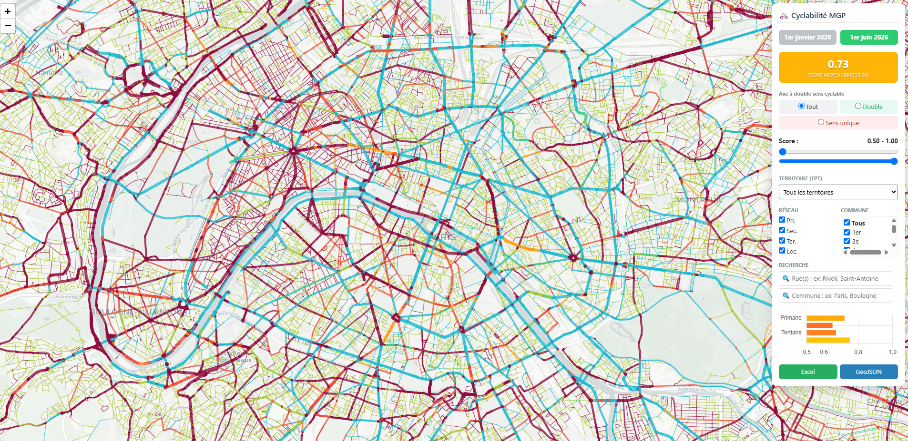

# 🚲 OSM Cyclability Scoring

*An open-source methodology for assessing bicycle network quality.*

---

## 📸 Aperçu/Overview

## 🇫🇷 Français

### Présentation
**OSM Cyclability Scoring** est une méthodologie et un ensemble d'outils open source permettant d'évaluer la qualité des infrastructures cyclables à partir des données **OpenStreetMap**. 

Initialement développé pour analyser le réseau de la **Métropole du Grand Paris**, cet outil permet de qualifier finement chaque segment de voirie pour aider à la planification et au suivi du développement du vélo.

### Fonctionnalités principales
- ✅ **Analyse automatisée** des réseaux routiers OSM.
- ✅ **Détection intelligente** des aménagements (pistes, bandes, voies vertes, vélorues).
- ✅ **Analyse avancée** : doubles sens cyclables, chaussées séparées, analyse de proximité spatiale.
- ✅ **Sorties exploitables** : scores par segment, exports GeoParquet, cartes interactives HTML.

### Public visé
Ce projet s'adresse aux collectivités, métropoles, autorités de mobilité, urbanistes, chercheurs et contributeurs OpenStreetMap souhaitant évaluer leur territoire de manière objective.

## 🏗 Architecture du projet

Le projet est structuré en deux modules principaux pour garantir la reproductibilité des données et l'efficacité des traitements :

### 1. Module d'extraction des données (`osm-data-extract`)
Dédié à la préparation lourde des données :
* **Traitement Geofabrik** : Consommation des extraits historiques bruts d'OpenStreetMap.
* **Découpage temporel** : Extraction du réseau routier à des dates spécifiques pour permettre des analyses comparatives et historiques.
* **Découpage spatial** : Définition des zones d'étude à partir des contours administratifs.
* **Optimisation** : Conversion des données nettoyées au format `GeoParquet` pour plus d'efficacité.

### 2. Moteur de calcul de la cyclabilité
Le cœur analytique du projet :
* **Scoring des infrastructures** : Application de la méthodologie pour évaluer la qualité par segment de voirie.
* **Calcul des indicateurs** : Gestion des doubles sens cyclables, détection des chaussées séparées et analyse de proximité spatiale.
* **Visualisation** : Génération de cartes web interactives en HTML et exports des résultats.

---

## 🇬🇧 English

### Overview
**OSM Cyclability Scoring** is an open-source methodology and toolkit designed to assess bicycle-friendliness using **OpenStreetMap** data.

Designed and refined for the **Greater Paris Metropolis (Métropole du Grand Paris)**, this project computes cyclability scores for road segments by integrating road hierarchy, dedicated cycling infrastructure, contraflow cycling, and spatial proximity analysis.

### Main Features
- ✅ **Automatic analysis** of OSM road networks.
- ✅ **Infrastructure detection** (tracks, lanes, greenways, cycle streets).
- ✅ **Advanced metrics**: contraflow assessment, dual carriageway detection, spatial proximity.
- ✅ **Actionable outputs**: segment-level scoring, GeoParquet datasets, and interactive web maps.

### Intended Users
The project serves local authorities, metropolitan governments, transport agencies, urban planners, researchers, and OpenStreetMap contributors interested in data-driven cycle network assessment.

## 🏗 Project Architecture

The project is structured into two main modules to ensure data reproducibility and efficient processing:

### 1. Data Extraction Module (`osm-data-extract`)
Responsible for heavy data lifting:
* **Geofabrik Processing**: Consumes raw OSM historical extracts.
* **Temporal Slicing**: Extracts the road network at specific dates for historical comparison.
* **Spatial Clipping**: Defines study areas using administrative boundaries.
* **Optimization**: Converts cleaned data into efficient `GeoParquet` formats.

### 2. Cyclability Scoring Engine
The core logic for analysis:
* **Infrastructure Scoring**: Applies the methodology to compute segment-level quality.
* **Metrics Calculation**: Handles contraflow, dual carriageway detection, and spatial proximity.
* **Visualization**: Generates HTML web maps and exports results.

---
